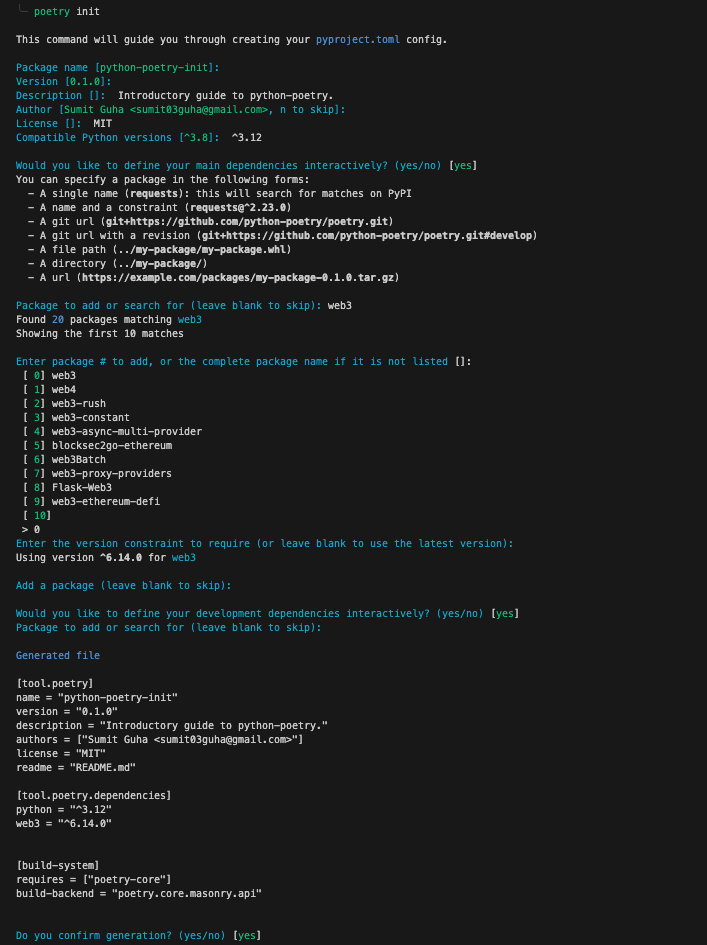

# Comprehensive Guide to Using Poetry for Python Project Management

## 1. Installing Poetry

- **Command**:

  ```shell
  curl -sSL https://install.python-poetry.org | python3 -
  ```

- **Description**: This command downloads and executes the Poetry installation script using `curl` and `python3`. Make sure you have Python 3 installed on your system.

## 2. Configuring the PATH

- **Command**:

  ```shell
  export PATH="/home/{username}/.local/bin:$PATH"
  ```

- **Description**: Add this line to your `.bashrc` or `.zshrc` file, replacing `{username}` with your actual username. This step ensures that the Poetry command line tool is accessible from any terminal session.

## 3. Verifying Installation

- **Command**:

  ```shell
  poetry --version
  ```

- **Description**: Run this command to check the installed version of Poetry and verify that it's correctly installed.

## 4. Enabling Autocompletion (for Zsh)

- **Command**:

  ```shell
  poetry completions zsh > $ZSH_CUSTOM/plugins/poetry/_poetry
  ```

- **Description**: This command generates and saves the Zsh autocompletion script for Poetry. Ensure the directory `$ZSH_CUSTOM/plugins/poetry` exists, and add `poetry` to the list of plugins in your `.zshrc`.

## 5. Setting up Project-specific Virtual Environments

- **Command**:

  ```shell
  poetry config virtualenvs.in-project true
  ```

- **Description**: This command configures Poetry to create virtual environments inside each project directory, rather than in a global location.

## 6. Creating a New Project

- **Command**:

  ```shell
  poetry init
  ```

- **Description**: This interactive command (see screenshot below) initializes a new Python project, helping you create a [pyproject.toml](./pyproject.toml) file with project metadata and dependencies.

  

## 7. Specifying Python Version

- **During `poetry init`**: Specify the desired Python version when prompted.
- **To change later**:
  - **Command**: `poetry env use {python version}`
  - **Description**: Use this command to change the Python version for the project. Ensure the specified version is installed on your system.

## 8. Adding Dependencies

- **Command**:

  ```shell
  poetry add {package name}
  ```

- **Description**: Use this command to add new dependencies to your project. Replace `{package name}` with the name of the dependency.

## 9. Installing Dependencies

- **Command**:

  ```shell
  poetry install
  ```

  or

  ```shell
  poetry install --no-root
  ```

- **Description**: Use `poetry install` to install all dependencies listed in `pyproject.toml`. Use `poetry install --no-root` to install dependencies without installing the project package itself.

### Conclusion

These steps cover the essentials of using Poetry for Python project management, from installation to setting up a project with dependencies. Poetry provides a powerful and efficient way to manage Python projects, dependencies, and virtual environments.
